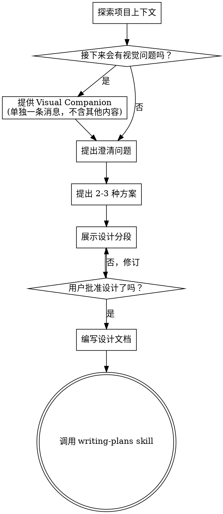

# 把想法打磨成设计

通过自然的协作式对话，把想法逐步收敛成完整的设计和规格说明。

先理解当前项目上下文，然后一次只问一个问题来细化想法。当你真正明白要构建什么之后，再展示设计并获得用户批准。

<HARD-GATE>
在你展示设计并获得用户批准之前，不要调用任何实现类 skill，不要写代码，不要搭脚手架，也不要采取任何实现动作。无论项目看起来多简单，这条都适用。
</HARD-GATE>

## 反模式：“这太简单了，不需要设计”

每个项目都必须经过这个流程。待办清单、小工具函数、配置修改，全都一样。越是“简单”的项目，越容易因为未经检验的假设而浪费时间。设计可以很短，真正简单的项目用几句话也行，但你**必须**先展示设计并获得批准。

## 清单

你必须为下面每一项创建任务，并按顺序完成：

1. **探索项目上下文** - 查看文件、文档和最近提交
2. **提供视觉 companion**（如果主题会涉及视觉问题）- 这一项必须单独发一条消息，不能和澄清问题放在一起。见下文“Visual Companion”部分。
3. **提出澄清问题** - 一次一个，理解目标、约束和成功标准
4. **提出 2-3 种方案** - 给出权衡，并说明你的推荐
5. **展示设计** - 按复杂度拆成多个部分，每一部分都在继续前取得用户确认
6. **编写设计文档** - 保存到 `docs/superpowers/specs/YYYY-MM-DD-<topic>-design.md` 并提交
7. **转入实现阶段** - 调用 `writing-plans` skill 来生成实现计划

## 流程

**这个流程的终态是调用 `writing-plans`。** 不要调用 `frontend-design`、`mcp-builder` 或任何其他实现类 skill。`brainstorming` 之后唯一应该接的 skill 就是 `writing-plans`。

## 具体过程

**理解想法：**

- 先查看当前项目状态（文件、文档、最近提交）
- 在问细节问题之前先判断范围：如果请求描述的是多个彼此独立的子系统（例如“做一个带聊天、文件存储、计费和分析的平台”），要立刻指出这一点。不要在一个本应拆分的项目上继续追问细节。
- 如果项目大到不适合写成单个 spec，就帮助用户拆成多个子项目：独立部分有哪些，它们如何关联，应该按什么顺序构建。然后只对第一个子项目走完整套 brainstorming 流程。每个子项目都应有自己的 spec -> plan -> implementation 周期。
- 对于范围合适的项目，一次只问一个问题来细化需求
- 如果可能，优先使用多选题；开放题也可以
- 每条消息只问一个问题；如果某个话题还需要深入，就拆成多轮
- 核心是理解：目标、约束、成功标准

**探索方案：**

- 提出 2-3 种不同方案，并讲清权衡
- 用对话式方式给出选项，同时说明你的推荐和原因
- 先给你推荐的方案，并解释为什么推荐它

**展示设计：**

- 当你认为自己已经理解要构建的东西后，再开始展示设计
- 每个部分的篇幅根据复杂度调整：简单问题几句话即可，复杂问题可以写到 200-300 字
- 每展示完一个部分，都要问用户“目前这部分是否正确”再继续
- 覆盖这些方面：架构、组件、数据流、错误处理、测试
- 如果发现某处说不通，要准备回退并继续澄清

**为隔离和清晰度而设计：**

- 将系统拆成更小的单元，每个单元只负责一件清晰的事，通过定义良好的接口通信，并且可以被独立理解和测试
- 对每个单元，你都应该回答得出：它做什么、怎么使用、依赖什么
- 是否有人不用读内部实现就能理解一个单元？你能否不破坏调用方就修改它的内部？如果不能，边界就需要重做
- 更小、更边界清晰的单元也更便于你工作。你更擅长推理能被完整装进上下文的代码；文件越聚焦，修改越可靠。文件一旦变得很大，通常意味着它承担了太多职责

**在现有代码库中工作：**

- 在提议修改之前先探索当前结构，遵循已有模式
- 如果现有代码里确实存在会影响当前任务的问题（例如文件过大、边界不清、职责缠绕），可以把针对性的改进纳入设计，就像一个好的工程师在顺手修理他正在工作的代码
- 不要提出与当前目标无关的重构。保持聚焦

## 设计之后

**文档：**

- 将已经验证通过的设计（spec）写入 `docs/superpowers/specs/YYYY-MM-DD-<topic>-design.md`
  - 如果用户对保存位置有偏好，以用户偏好为准
- 如果可用，使用 `elements-of-style:writing-clearly-and-concisely` skill
- 将设计文档提交到 git

**Spec 审查循环：**
写完 spec 文档后：

1. 派发 `spec-document-reviewer` 子代理（见 `spec-document-reviewer-prompt.md`）
2. 如果发现问题：修复，重新派发，直到 Approved
3. 如果循环超过 5 次，交给人类用户决定

**实现：**

- 调用 `writing-plans` skill 生成详细实现计划
- 不要调用任何其他 skill。下一步就是 `writing-plans`

## 关键原则

- **一次只问一个问题** - 不要用多个问题压垮用户
- **优先多选** - 在可能的情况下，多选比开放题更容易回答
- **狠抓 YAGNI** - 从所有设计里移除不必要的功能
- **探索替代方案** - 在定方案前始终提出 2-3 个选择
- **增量式验证** - 展示设计，在继续之前获得批准
- **保持灵活** - 发现说不通时，回到澄清阶段

## Visual Companion

这是一个基于浏览器的 companion，用来在 brainstorming 过程中展示 mockup、图示和可视化选项。它是一个工具，不是一种模式。用户接受 companion，只代表它在那些适合视觉表达的问题上可用，并不意味着之后每个问题都必须通过浏览器来做。

**如何提出 companion：** 当你预判接下来的问题会涉及视觉内容（mockup、布局、图示）时，要先单独征求一次用户同意：
> "Some of what we're working on might be easier to explain if I can show it to you in a web browser. I can put together mockups, diagrams, comparisons, and other visuals as we go. This feature is still new and can be token-intensive. Want to try it? (Requires opening a local URL)"

**这段邀请必须是单独的一条消息。** 不要和澄清问题、上下文总结或其他任何内容混在一起。那条消息里只能有上面的邀请文本。发出后等待用户回应。如果用户拒绝，就继续用纯文本方式 brainstorming。

**每个问题都单独决策：** 即使用户接受了 companion，你也必须对每个问题重新判断该用浏览器还是终端。判断标准是：**用户是看见它会更容易理解，还是读文字就足够？**

- **使用浏览器**：当内容本身就是视觉性的，例如 mockup、线框图、布局对比、架构图、并排展示的视觉设计
- **使用终端**：当内容本身是文本性的，例如需求问题、概念选择、权衡列表、A/B/C/D 文本选项、范围决定

关于 UI 主题的问题不一定就是视觉问题。“这里的人格化是什么意思？”属于概念问题，应在终端里问；“哪个 wizard 布局更合适？”是视觉问题，应该用浏览器。

如果用户同意使用 companion，在继续前先阅读详细指南：
`skills/brainstorming/visual-companion.md`
