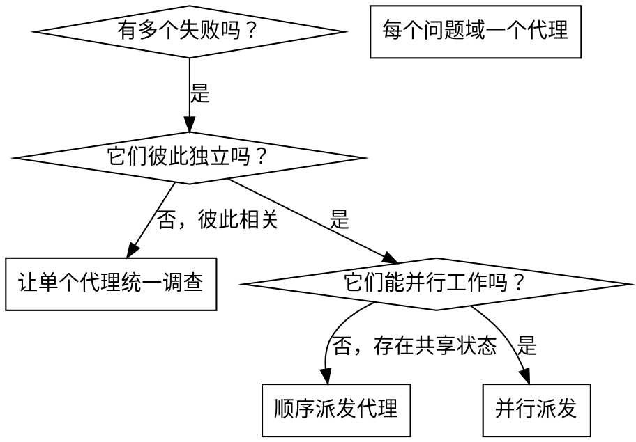

# 派发并行代理

## 概述

当你遇到多个互不相关的失败时（不同测试文件、不同子系统、不同 bug），按顺序一个个调查是在浪费时间。每个调查彼此独立，可以并行发生。

**核心原则：** 每个独立问题域派发一个代理，让它们并发工作。

## 何时使用



**适用场景：**
- 3 个以上测试文件失败，且根因各不相同
- 多个子系统独立损坏
- 每个问题都可以在不依赖其他问题上下文的情况下被理解
- 各项调查之间不存在共享状态

**不适用场景：**
- 失败彼此相关，修一个可能连带修掉其他
- 必须先理解完整系统状态
- 代理之间会互相干扰

## 模式

### 1. 识别独立问题域

按“哪里坏了”分组：
- 文件 A 的测试：工具批准流程
- 文件 B 的测试：批次完成行为
- 文件 C 的测试：中止功能

每个域都是独立的。修工具批准逻辑，通常不会影响中止测试。

### 2. 为代理创建聚焦任务

每个代理应拿到：
- **明确范围：** 一个测试文件或一个子系统
- **清晰目标：** 让这些测试通过
- **约束条件：** 不要改其他代码
- **预期输出：** 总结你发现了什么，以及修了什么

### 3. 并行派发

```typescript
// 在 Claude Code / AI 环境中
Task("Fix agent-tool-abort.test.ts failures")
Task("Fix batch-completion-behavior.test.ts failures")
Task("Fix tool-approval-race-conditions.test.ts failures")
// 三个任务并发执行
```

### 4. 审阅并集成

代理返回后：
- 阅读每份总结
- 验证修复之间没有冲突
- 跑完整测试套件
- 整合集成所有改动

## 代理提示结构

好的代理提示应该具备：
1. **聚焦** - 一个明确的问题域
2. **自包含** - 包含理解问题所需的全部上下文
3. **明确输出要求** - 代理最终应该返回什么

```markdown
Fix the 3 failing tests in src/agents/agent-tool-abort.test.ts:

1. "should abort tool with partial output capture" - expects 'interrupted at' in message
2. "should handle mixed completed and aborted tools" - fast tool aborted instead of completed
3. "should properly track pendingToolCount" - expects 3 results but gets 0

These are timing/race condition issues. Your task:

1. Read the test file and understand what each test verifies
2. Identify root cause - timing issues or actual bugs?
3. Fix by:
   - Replacing arbitrary timeouts with event-based waiting
   - Fixing bugs in abort implementation if found
   - Adjusting test expectations if testing changed behavior

Do NOT just increase timeouts - find the real issue.

Return: Summary of what you found and what you fixed.
```

## 常见错误

**❌ 范围太大：** “把所有测试都修了” - 代理会迷失
**✅ 明确具体：** “修 `agent-tool-abort.test.ts`” - 范围清晰

**❌ 没有上下文：** “修这个竞态条件” - 代理根本不知道在哪
**✅ 有上下文：** 贴上错误信息和测试名

**❌ 没有约束：** 代理可能会顺手重构一切
**✅ 有约束：** “不要改生产代码”或“只修测试”

**❌ 输出要求模糊：** “修掉它” - 你无法知道到底改了什么
**✅ 输出要求明确：** “返回根因和修改内容的总结”

## 什么时候不该用

**相关联的失败：** 修一个可能顺带修另一个，应先一起调查
**需要全局上下文：** 只有看完整系统才能理解
**探索式调试：** 你甚至还不知道具体坏在哪里
**共享状态：** 多个代理会相互干扰（编辑同一文件、使用同一资源）

## 来自真实会话的示例

**场景：** 大规模重构后，3 个文件里有 6 个测试失败

**失败分布：**
- `agent-tool-abort.test.ts`：3 个失败（时序问题）
- `batch-completion-behavior.test.ts`：2 个失败（工具没有执行）
- `tool-approval-race-conditions.test.ts`：1 个失败（执行计数为 0）

**判断：** 三个问题域相互独立。中止逻辑、批次完成、批准竞态各自分开

**派发：**
```text
Agent 1 -> Fix agent-tool-abort.test.ts
Agent 2 -> Fix batch-completion-behavior.test.ts
Agent 3 -> Fix tool-approval-race-conditions.test.ts
```

**结果：**
- Agent 1：把 timeout 换成基于事件的等待
- Agent 2：修复事件结构 bug（`threadId` 放错位置）
- Agent 3：等待异步工具执行真正完成后再断言

**集成：** 所有修复彼此独立，没有冲突，完整套件转绿

**节省的时间：** 3 个问题并行解决，而不是串行一个接一个处理

## 关键收益

1. **并行化** - 多个调查同时进行
2. **聚焦** - 每个代理只处理一小块上下文
3. **独立性** - 代理之间不互相干扰
4. **速度** - 3 个问题的总耗时接近 1 个问题

## 验证

代理返回后：
1. **审阅每份总结** - 明确到底改了什么
2. **检查冲突** - 是否改到了同一片代码
3. **运行完整套件** - 验证所有修复能一起工作
4. **抽样检查** - 代理也会犯系统性错误

## 真实效果

来自一次调试会话（2025-10-03）：
- 3 个文件中一共 6 个失败
- 并行派发了 3 个代理
- 所有调查并发完成
- 所有修复都被成功集成
- 代理修改之间零冲突
