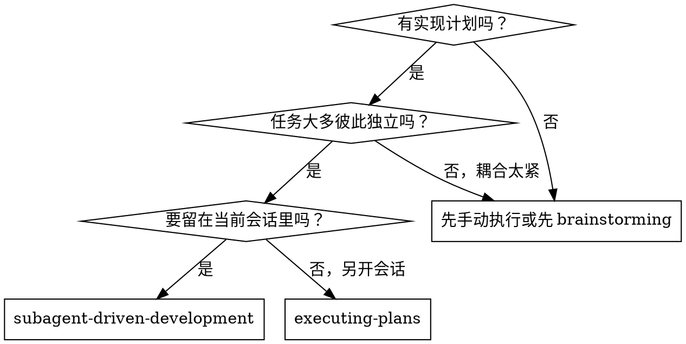
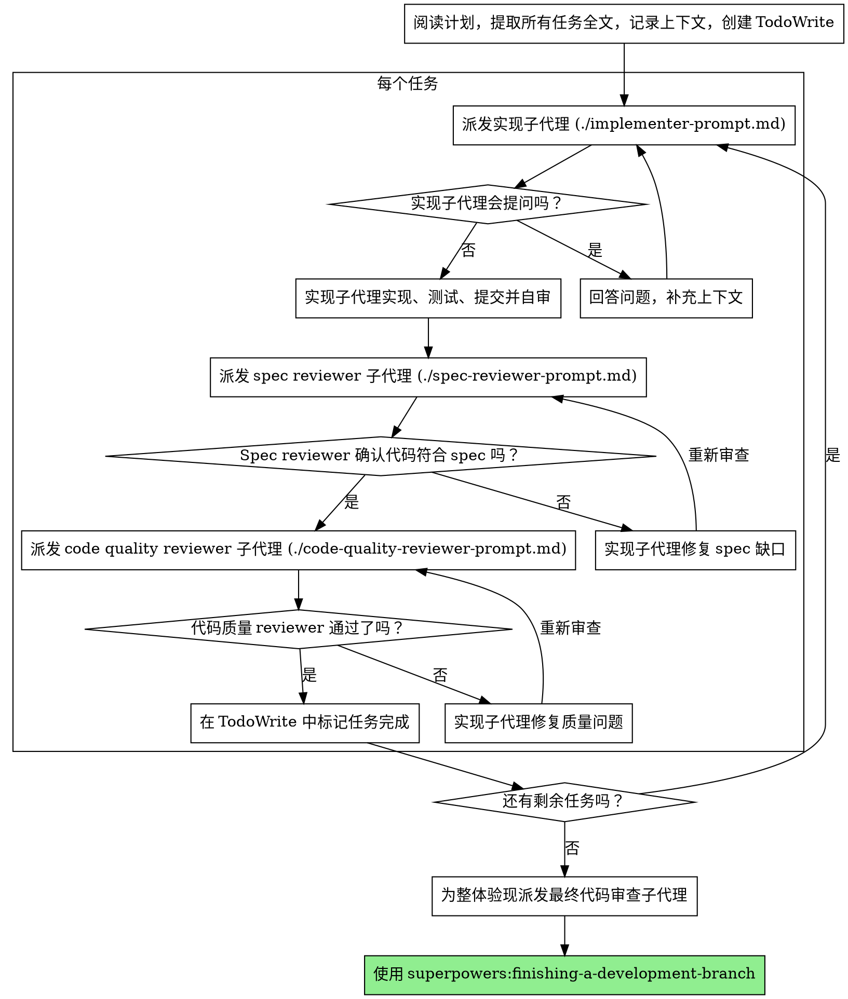

# 子代理驱动开发

通过为每个任务派发新的子代理来执行计划，并在每个任务后做两阶段评审：先审 spec 一致性，再审代码质量。

**核心原则：** 每个任务一个全新的子代理 + 两阶段评审（先 spec，后质量）= 高质量、快速迭代。

## 何时使用



**与 `executing-plans` 相比（并行会话版）：**
- 保持在同一个会话中，无需上下文切换
- 每个任务都用新的子代理，避免上下文污染
- 每个任务后固定做两阶段评审：先 spec 一致性，再代码质量
- 迭代更快，不需要每个任务之间都让人类介入

## 流程



## 模型选择

为了控制成本并提升速度，要为不同角色选择能胜任任务的最低档模型。

**机械性实现任务**（孤立函数、spec 明确、1-2 个文件）：用快速便宜的模型。只要计划足够清晰，大多数实现任务本质上都是机械执行。

**集成和判断任务**（多文件协同、模式匹配、调试）：用标准模型。

**架构、设计和审查任务**：用当前可用的最强模型。

**任务复杂度信号：**
- 只动 1-2 个文件，且 spec 完整 -> 便宜模型
- 涉及多个文件并有集成顾虑 -> 标准模型
- 需要设计判断或广泛理解代码库 -> 最强模型

## 处理实现子代理状态

实现子代理会返回四种状态，你必须正确处理：

**DONE：** 继续进入 spec 一致性审查。

**DONE_WITH_CONCERNS：** 子代理完成了工作，但带着疑虑。先读这些疑虑。如果疑虑涉及正确性或范围，要先处理再送审；如果只是观察性意见（如“这个文件越来越大了”），记录下来并继续送审。

**NEEDS_CONTEXT：** 子代理缺少必要信息。补齐上下文后重新派发。

**BLOCKED：** 子代理无法完成任务。你要评估 blocker：
1. 如果是上下文问题，补上下文并用同一个模型重新派发
2. 如果任务需要更多推理能力，换更强模型重新派发
3. 如果任务太大，拆成更小的部分
4. 如果是计划本身有问题，升级给用户

**永远不要**忽略升级信号，也不要在不做任何改变的情况下强行让同一个模型重试。如果实现子代理说它卡住了，就意味着必须改变某些条件。

## Prompt 模板

- `./implementer-prompt.md` - 派发实现子代理
- `./spec-reviewer-prompt.md` - 派发 spec 一致性审查子代理
- `./code-quality-reviewer-prompt.md` - 派发代码质量审查子代理

## 示例工作流

```text
You: I'm using Subagent-Driven Development to execute this plan.

[Read plan file once: docs/superpowers/plans/feature-plan.md]
[Extract all 5 tasks with full text and context]
[Create TodoWrite with all tasks]

Task 1: Hook installation script

[Get Task 1 text and context (already extracted)]
[Dispatch implementation subagent with full task text + context]

Implementer: "Before I begin - should the hook be installed at user or system level?"

You: "User level (~/.config/superpowers/hooks/)"

Implementer: "Got it. Implementing now..."
[Later] Implementer:
  - Implemented install-hook command
  - Added tests, 5/5 passing
  - Self-review: Found I missed --force flag, added it
  - Committed

[Dispatch spec compliance reviewer]
Spec reviewer: ✅ Spec compliant - all requirements met, nothing extra

[Get git SHAs, dispatch code quality reviewer]
Code reviewer: Strengths: Good test coverage, clean. Issues: None. Approved.

[Mark Task 1 complete]

Task 2: Recovery modes

[Get Task 2 text and context (already extracted)]
[Dispatch implementation subagent with full task text + context]

Implementer: [No questions, proceeds]
Implementer:
  - Added verify/repair modes
  - 8/8 tests passing
  - Self-review: All good
  - Committed

[Dispatch spec compliance reviewer]
Spec reviewer: ❌ Issues:
  - Missing: Progress reporting (spec says "report every 100 items")
  - Extra: Added --json flag (not requested)

[Implementer fixes issues]
Implementer: Removed --json flag, added progress reporting

[Spec reviewer reviews again]
Spec reviewer: ✅ Spec compliant now

[Dispatch code quality reviewer]
Code reviewer: Strengths: Solid. Issues (Important): Magic number (100)

[Implementer fixes]
Implementer: Extracted PROGRESS_INTERVAL constant

[Code reviewer reviews again]
Code reviewer: ✅ Approved

[Mark Task 2 complete]

...

[After all tasks]
[Dispatch final code-reviewer]
Final reviewer: All requirements met, ready to merge

Done!
```

## 优势

**相对手工执行：**
- 子代理天然更容易遵循 TDD
- 每个任务都有全新上下文，减少混乱
- 并行安全，不同子代理互不干扰
- 子代理可以在开始前和过程中提问

**相对 `executing-plans`：**
- 同一会话内执行，无需交接
- 进展连续，不用停下来等
- 评审检查点是自动内建的

**效率收益：**
- 控制器直接提供完整任务文本，无需每个子代理重复读文件
- 控制器只提供必要上下文
- 子代理一开始就拿到完整信息
- 问题会在开工前暴露，而不是做完后才发现

**质量门禁：**
- 自审能在交接前抓掉一批问题
- 两阶段评审：先 spec 一致性，再代码质量
- 审查循环确保修复真的到位
- Spec 一致性防止做多或做少
- 代码质量审查保证实现质量过关

**成本：**
- 每个任务至少会多出实现者 + 两个 reviewer 的子代理调用
- 控制器需要提前做更多准备（一次性提取所有任务）
- 审查循环会带来额外轮次
- 但它能更早发现问题，通常比后期调试更便宜

## 红旗

**绝不要：**
- 没有用户明确同意就在 `main/master` 分支上开始实现
- 跳过评审（spec 一致性或代码质量任一都不行）
- 带着未修复问题继续往下走
- 并行派发多个实现子代理（会冲突）
- 让子代理自己去读计划文件（你应该提供完整文本）
- 跳过场景上下文设置（子代理必须理解任务在整体中的位置）
- 忽略子代理问题（先回答，再让它继续）
- 对 spec 一致性采用“差不多就行”的标准
- 跳过审查循环（发现问题 -> 修复 -> 再审）
- 让实现子代理的自审代替正式评审
- **在 spec 一致性还没 ✅ 之前就开始代码质量评审**
- 在任一评审还存在开放问题时就切到下一个任务

**如果子代理提出问题：**
- 清楚、完整地回答
- 必要时补充更多上下文
- 不要催它在信息不足的情况下先去实现

**如果 reviewer 发现问题：**
- 由同一个实现子代理去修
- reviewer 重新审查
- 重复直到通过
- 不要跳过复审

**如果子代理没完成任务：**
- 派发一个带具体指令的修复子代理
- 不要自己手工补几下（那会污染控制器上下文）

## 集成关系

**必需的工作流 skills：**
- **`superpowers:using-git-worktrees`** - 开始前必须建立隔离工作区
- **`superpowers:writing-plans`** - 生成本 skill 要执行的计划
- **`superpowers:requesting-code-review`** - 提供 reviewer 子代理的代码审查模板
- **`superpowers:finishing-a-development-branch`** - 所有任务完成后负责收尾

**子代理应使用：**
- **`superpowers:test-driven-development`** - 子代理应对每个任务遵循 TDD

**可替代的工作流：**
- **`superpowers:executing-plans`** - 如果要在平行会话中执行，而不是当前会话
