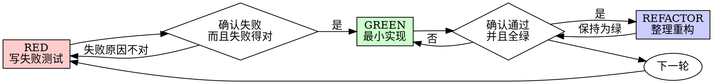

# 测试驱动开发（TDD）

## 概述

先写测试。看着它失败。再写最小代码让它通过。

**核心原则：** 如果你没有亲眼看着测试先失败，就无法证明这个测试真的测到了正确的东西。

**违背规则的字面含义，就是违背规则的精神。**

## 何时使用

**始终适用：**
- 新功能
- Bug 修复
- 重构
- 行为变化

**例外情况（要先问用户）：**
- 一次性原型
- 生成代码
- 纯配置文件

如果你在想“这次先别 TDD 了”，停下。这就是找借口。

## 铁律

```text
没有先失败的测试，就不允许写生产代码
```

如果你在测试之前已经写了代码：删掉，重来。

**没有例外：**
- 不要把它留作“参考”
- 不要一边写测试一边“参考着改”
- 不要继续看那段提前写出来的代码
- 删除就是真的删除

必须从测试重新开始实现。就是这样。

## Red-Green-Refactor



### RED：写失败测试

写一个最小测试，明确说明应该发生什么。

<Good>
```typescript
test('retries failed operations 3 times', async () => {
  let attempts = 0;
  const operation = () => {
    attempts++;
    if (attempts < 3) throw new Error('fail');
    return 'success';
  };

  const result = await retryOperation(operation);

  expect(result).toBe('success');
  expect(attempts).toBe(3);
});
```
名字清晰，测真实行为，只测一件事
</Good>

<Bad>
```typescript
test('retry works', async () => {
  const mock = jest.fn()
    .mockRejectedValueOnce(new Error())
    .mockRejectedValueOnce(new Error())
    .mockResolvedValueOnce('success');
  await retryOperation(mock);
  expect(mock).toHaveBeenCalledTimes(3);
});
```
名字模糊，测的是 mock 而不是代码
</Bad>

**要求：**
- 只测一种行为
- 名字清晰
- 测真实代码，不到万不得已不要 mock

### 验证 RED：看着它失败

**这是强制步骤，不能跳过。**

```bash
npm test path/to/test.test.ts
```

确认：
- 测试失败，而不是报错
- 失败信息符合预期
- 失败原因是功能没实现，而不是拼写错之类的低级错误

**如果测试直接通过了：** 你测的是已有行为。修正测试。

**如果测试报错了：** 修掉错误，重新跑，直到它以正确方式失败。

### GREEN：写最小实现

写出刚好能通过测试的最简单代码。

<Good>
```typescript
async function retryOperation<T>(fn: () => Promise<T>): Promise<T> {
  for (let i = 0; i < 3; i++) {
    try {
      return await fn();
    } catch (e) {
      if (i === 2) throw e;
    }
  }
  throw new Error('unreachable');
}
```
刚好够用
</Good>

<Bad>
```typescript
async function retryOperation<T>(
  fn: () => Promise<T>,
  options?: {
    maxRetries?: number;
    backoff?: 'linear' | 'exponential';
    onRetry?: (attempt: number) => void;
  }
): Promise<T> {
  // YAGNI
}
```
过度设计
</Bad>

不要额外加功能，不要顺手重构别处，也不要“顺便改好一点”。

### 验证 GREEN：看着它通过

**这一步同样强制。**

```bash
npm test path/to/test.test.ts
```

确认：
- 这个测试通过了
- 其他测试也依然通过
- 输出干净，没有额外错误和 warning

**如果测试失败：** 修代码，不要改测试。

**如果其他测试挂了：** 立刻修。

### REFACTOR：整理代码

只有在 GREEN 之后才能做：
- 去重
- 改善命名
- 提取辅助函数

保持测试为绿。不要在这个阶段增加行为。

### 重复

下一个功能，就从下一个失败测试开始。

## 好的测试

| 质量 | 好 | 坏 |
|------|----|----|
| **最小化** | 只测一件事。名字里有 `and` 就该拆开。 | `test('validates email and domain and whitespace')` |
| **清晰** | 名字描述行为 | `test('test1')` |
| **体现意图** | 展示期望 API | 让人看不出代码应该做什么 |

## 为什么顺序重要

**“我先写代码，之后补测试验证一下就行”**

测试如果是在代码之后才写出来，它一上来就通过，无法证明任何事情：
- 你可能测错东西
- 你可能测的是实现细节，而不是行为
- 你可能漏掉边界情况
- 你从没看过它真正抓到 bug

测试先行强迫你先定义“应该怎样”，而不是“已经写成了什么样”。

**“我已经手工测过所有边界情况了”**

手工测试是临时性的。你以为自己测全了，但实际上：
- 没有记录
- 代码改了之后无法重跑
- 压力下很容易漏情况
- “我试的时候能跑”不等于覆盖完整

自动化测试是系统化的。它们每次都以同样方式运行。

**“删掉几个小时的工作太浪费了”**

这是沉没成本谬误。时间已经花掉了。你现在只有两个选择：
- 删掉并用 TDD 重写（再花 X 小时，但有高信心）
- 保留它并事后补测试（看似省 30 分钟，但低信心，后面大概率还有 bug）

真正的浪费，是保留一段你无法信任的代码。没有真实测试支撑的“能跑代码”，本质上是技术债。

**“TDD 太教条了，真正务实应该灵活一点”**

TDD 本身就是务实：
- 在提交前发现 bug
- 防止回归
- 用测试文档化行为
- 让你敢于重构

所谓“务实地跳过 TDD”，通常只是把调试成本往后推。

**“事后补测试也能达到一样效果，这只是形式不是本质”**

不对。事后补测试回答的是“这段代码现在做了什么”，测试先行回答的是“它应该做什么”。

事后补测试天然会被你的实现带偏。你测的是你已经写出来的东西，而不是需求本身。你验证的是自己还记得哪些边界情况，而不是被迫在实现前发现它们。

30 分钟的事后补测试 ≠ TDD。你也许得到了覆盖率，但你失去了“测试真的能抓 bug”的证明。

## 常见借口

| 借口 | 现实 |
|------|------|
| “太简单了，不值得写测试” | 简单代码一样会坏。测试可能只要 30 秒。 |
| “我之后补测试” | 事后补的测试无法证明它有用。 |
| “测试后写也能达到一样效果” | 事后补测试问的是“它做了什么”，测试先行问的是“它该做什么”。 |
| “我已经手工测过了” | 手工测试不系统、不可复跑。 |
| “已经写了几个小时，删掉太浪费” | 这是沉没成本。保留无法信任的代码才是真浪费。 |
| “保留当参考，我再补测试” | 你会被它带偏。删掉就是删掉。 |
| “我先探索一下” | 可以探索，但探索代码要丢掉，正式实现要从 TDD 重新开始。 |
| “测试太难写” | 很可能说明设计本身就不够清晰。 |
| “TDD 会拖慢我” | TDD 比事后调试更快。真正务实就是测试先行。 |
| “手工测更快” | 手工测试无法证明边界情况，而且每次改代码都得重来。 |
| “现有代码本来就没测试” | 你正在改善它。那就从现在开始补测试。 |

## Red Flag：出现就停下并重来

- 先写了代码再写测试
- 测试写出来立刻就通过
- 说不清为什么测试失败
- 打算“后面再补测试”
- 说“就这一次”
- 说“我已经手工测过了”
- 说“测试后写也能达到同样效果”
- 说“这是精神，不是仪式”
- 说“保留做参考”或“我就改着参考一下”
- 说“已经花了很多时间，删掉太浪费”
- 说“TDD 太教条了，我只是更务实”
- 说“这次不一样，因为……”

**这些都意味着：删掉代码，按 TDD 重来。**

## 示例：修复一个 bug

**Bug：** 空邮箱也被接受

**RED**
```typescript
test('rejects empty email', async () => {
  const result = await submitForm({ email: '' });
  expect(result.error).toBe('Email required');
});
```

**验证 RED**
```bash
$ npm test
FAIL: expected 'Email required', got undefined
```

**GREEN**
```typescript
function submitForm(data: FormData) {
  if (!data.email?.trim()) {
    return { error: 'Email required' };
  }
  // ...
}
```

**验证 GREEN**
```bash
$ npm test
PASS
```

**REFACTOR**
如果后面有多个字段需要同类验证，再提取公共逻辑。

## 验证清单

在你宣称工作完成之前，必须能全部勾选：
- [ ] 每个新增函数或方法都有测试
- [ ] 每个测试在实现前都亲眼看到失败过
- [ ] 每个测试失败的原因都符合预期（缺功能，而不是拼写错误）
- [ ] 每次都只写了最小实现使测试通过
- [ ] 所有测试都通过
- [ ] 输出干净
- [ ] 测试针对真实代码，而不是主要针对 mock
- [ ] 边界情况和错误情况都覆盖到了

不能全勾上？说明你没有真正做 TDD。

## 卡住时怎么办

| 问题 | 解决办法 |
|------|----------|
| 不知道怎么测试 | 先写你希望存在的 API，再写断言。必要时问用户。 |
| 测试太复杂 | 设计太复杂。先简化接口。 |
| 什么都得 mock | 代码耦合太紧。考虑依赖注入。 |
| 测试初始化很大 | 提取 helper。如果仍然很复杂，就继续简化设计。 |

## Debugging 集成

一旦发现 bug，就先写一个能复现它的失败测试，然后走完整个 TDD 循环。测试既证明修复有效，也防止回归。

永远不要在没有测试的情况下修 bug。

## 测试反模式

当你要加入 mock 或测试工具时，先阅读 `@testing-anti-patterns.md`，避免这些常见问题：
- 测的是 mock 行为，而不是真实行为
- 给生产类加入“只为测试用”的方法
- 在没理解依赖的情况下盲目 mock

## 最终规则

```text
生产代码 -> 测试已经存在，并且先失败过
否则 -> 这不叫 TDD
```

除非用户明确允许，否则没有例外。
