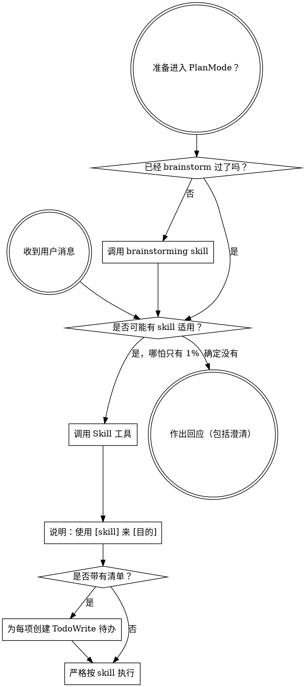

<SUBAGENT-STOP>
如果你是作为子代理被派发来执行某个具体任务的，请跳过这个 skill。
</SUBAGENT-STOP>

<EXTREMELY-IMPORTANT>
如果你觉得某个 skill 有哪怕 1% 的可能适用于当前任务，你都必须调用它。

只要某个 skill 适用于任务，你就没有选择权。你必须使用它。

这不是可以协商的事，也不是可选项。不要为跳过它找借口。
</EXTREMELY-IMPORTANT>

## 指令优先级

Superpowers skill 会覆盖默认 system prompt 的行为，但**用户指令永远优先**：

1. **用户的显式指令**（`CLAUDE.md`、`AGENTS.md`、直接请求）- 最高优先级
2. **Superpowers skills** - 在冲突时覆盖默认系统行为
3. **默认 system prompt** - 最低优先级

如果 `CLAUDE.md` 或 `AGENTS.md` 说“不要用 TDD”，而某个 skill 说“始终使用 TDD”，那就遵循用户指令。控制权在用户手里。

## 如何访问 Skills

**在 Claude Code 中：** 使用 `Skill` 工具。调用 skill 后，它的内容会被加载并展示给你，你要直接按它执行。绝不要用 Read 工具去读取 skill 文件。

**在其他环境中：** 查看对应平台文档，确认 skill 是如何加载的。

## 平台适配

skill 文档使用的是 Claude Code 的工具名。非 Claude Code 平台请查看 `references/codex-tools.md` 中的等价工具说明。

# 使用 Skills

## 基本规则

**在做出任何响应或执行任何动作之前，先调用相关或被请求的 skill。** 只要存在 1% 的可能性，就应该先调用 skill 来检查。如果调用后发现它并不适用，那可以不继续使用它。

## Red Flag

一旦出现下面这些想法，就该立刻停下，因为你正在为跳过流程找理由：

| 想法 | 现实 |
|------|------|
| "这只是个简单问题" | 问题也是任务。先检查 skill。 |
| "我得先补点上下文" | skill 检查必须发生在澄清问题之前。 |
| "我先看看代码库" | 怎么探索代码库应由 skill 告诉你。先检查 skill。 |
| "我先查一下 git 和文件" | 文件本身没有会话上下文。先检查 skill。 |
| "我先收集点信息" | 如何收集信息应由 skill 决定。 |
| "这不需要正式的 skill" | 只要有 skill，就要用。 |
| "我记得这个 skill" | skill 会演进。要读当前版本。 |
| "这不算任务" | 只要有动作就是任务。先检查 skill。 |
| "这个 skill 过度了" | 简单事最容易变复杂。用它。 |
| "我先做这一步再说" | 在做任何事之前先检查。 |
| "这样做感觉很高效" | 没有纪律的行动只会浪费时间。skill 就是为此存在的。 |
| "我知道这是什么意思" | 知道概念不等于用了 skill。先调用。 |

## Skill 优先级

当多个 skill 都可能适用时，按这个顺序判断：

1. **流程型 skill 优先**（如 `brainstorming`、`debugging`）- 它们决定你应该如何处理任务
2. **实现型 skill 其次**（如 `frontend-design`、`mcp-builder`）- 它们指导具体执行

“来构建 X” -> 先 `brainstorming`，再实现型 skill。
“修这个 bug” -> 先 `debugging`，再领域相关 skill。

## Skill 类型

**刚性技能**（TDD、调试）：必须严格照做，不要为了“灵活”而偏离纪律。

**柔性技能**（模式类）：可以结合上下文调整其原则。

具体属于哪种，由 skill 自己说明。

## 用户指令

用户指令定义的是“做什么”，不是“怎么做”。“加个 X”或“修个 Y”并不意味着可以跳过工作流。
