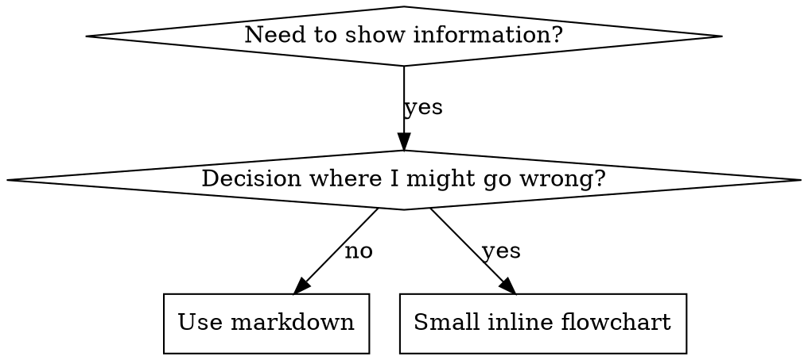

# 编写 Skills

## 概述

**编写 skills，本质上就是把测试驱动开发应用到流程文档上。**

**个人 skills 存放在各代理专属目录中**（Claude Code 用 `~/.claude/skills`，Codex 用 `~/.agents/skills/`）

你先写测试用例（对子代理施压的场景），看着它们失败（基线行为），再写 skill（文档），再看测试通过（代理开始遵守），最后重构（堵住漏洞）。

**核心原则：** 如果你没有亲眼看到代理在没有这个 skill 时失败，你就不知道这个 skill 是否真的教对了东西。

**必需背景：** 在使用这个 skill 之前，你**必须**理解 `superpowers:test-driven-development`。那个 skill 定义了基础的 RED-GREEN-REFACTOR 循环。这个 skill 是把 TDD 适配到文档编写上。

**官方指导：** 关于 Anthropic 官方的 skill 编写最佳实践，请参见 `anthropic-best-practices.md`。该文档提供了额外的模式和指南，可与本 skill 中偏重 TDD 的方法互补。

## 什么是 Skill？

一个 **skill** 是对已验证技巧、模式或工具的参考指南。Skills 帮助未来的 Claude 实例找到并应用有效的方法。

**Skills 是：** 可复用的技巧、模式、工具、参考指南

**Skills 不是：** 对你某次解决问题过程的叙事记录

## Skills 的 TDD 映射

| TDD 概念 | Skill 创建中的对应物 |
|-------------|----------------|
| **测试用例** | 带压力的子代理场景 |
| **生产代码** | Skill 文档（`SKILL.md`） |
| **测试失败（RED）** | 没有 skill 时代理违反规则（基线） |
| **测试通过（GREEN）** | 有了 skill 后代理开始遵守 |
| **重构** | 在保持遵守的同时堵住漏洞 |
| **先写测试** | 在写 skill **之前**先运行基线场景 |
| **看它失败** | 记录代理使用的精确找借口方式 |
| **最小代码** | 只写针对这些具体违规的 skill |
| **看它通过** | 验证代理现在会遵守 |
| **重构循环** | 发现新的找借口方式 -> 堵住 -> 重新验证 |

整个 skill 创建过程都遵循 RED-GREEN-REFACTOR。

## 什么时候该创建 Skill

**适合创建的情况：**
- 这个技巧对你来说并不直观
- 你以后还会在多个项目里参考它
- 这个模式具有普遍性（不是项目专属）
- 别人也会从中受益

**不该为这些情况创建：**
- 一次性解法
- 别处已有充分文档的标准实践
- 项目专属约定（放进 `CLAUDE.md`）
- 机械性约束（如果能用正则或校验强制执行，就自动化它，把文档留给需要判断的部分）

## Skill 类型

### Technique
带有步骤的具体方法（`condition-based-waiting`、`root-cause-tracing`）

### Pattern
一种思考问题的方式（`flatten-with-flags`、`test-invariants`）

### Reference
API 文档、语法指南、工具文档（office docs）

## 目录结构

```
skills/
  skill-name/
    SKILL.md              # 主参考文档（必需）
    supporting-file.*     # 仅在需要时添加
```

**扁平命名空间** - 所有 skills 都在一个可搜索的命名空间里

**以下内容应拆分到单独文件：**
1. **重型参考**（100+ 行）- API 文档、完整语法
2. **可复用工具** - 脚本、工具、模板

**以下内容应保留内联：**
- 原则和概念
- 代码模式（< 50 行）
- 其他所有内容

## `SKILL.md` 结构

**Frontmatter（YAML）：**
- 只支持两个字段：`name` 和 `description`
- 总长度上限为 1024 个字符
- `name`：只用字母、数字和连字符（不要括号、特殊字符）
- `description`：用第三人称，只描述**何时使用**（不要描述它做什么）
  - 以 `Use when...` 开头，聚焦触发条件
  - 包含具体的症状、情境和上下文
  - **绝不要总结这个 skill 的流程或工作流**（原因见 CSO 小节）
  - 如果可能，尽量控制在 500 字符以内

```markdown
---
name: Skill-Name-With-Hyphens
description: Use when [specific triggering conditions and symptoms]
---

# Skill Name

## Overview
What is this? Core principle in 1-2 sentences.

## When to Use
[Small inline flowchart IF decision non-obvious]

Bullet list with SYMPTOMS and use cases
When NOT to use

## Core Pattern (for techniques/patterns)
Before/after code comparison

## Quick Reference
Table or bullets for scanning common operations

## Implementation
Inline code for simple patterns
Link to file for heavy reference or reusable tools

## Common Mistakes
What goes wrong + fixes

## Real-World Impact (optional)
Concrete results
```

## Claude 搜索优化（CSO）

**对被发现至关重要：** 未来的 Claude 需要能**找到**你的 skill

### 1. 丰富的 Description 字段

**目的：** Claude 会读取 description 来决定某个任务该加载哪些 skills。这个字段要能回答：“我现在应该读这个 skill 吗？”

**格式：** 以 `Use when...` 开头，聚焦触发条件

**关键点：Description = 何时使用，而不是 Skill 做什么**

description 应该**只**描述触发条件。不要在 description 中总结 skill 的流程或工作流。

**为什么这很重要：** 测试发现，当 description 总结了 skill 的工作流时，Claude 可能会直接照 description 执行，而不去读完整的 skill 内容。曾有一个 description 写着 “code review between tasks”，结果 Claude 只做了**一次** review，尽管 skill 的流程图清楚写着要做**两次** review（规格符合性和代码质量）。

当 description 被改成仅仅 “Use when executing implementation plans with independent tasks” （不总结工作流）之后，Claude 就会正确读取流程图并遵循两阶段 review 流程。

**陷阱：** 总结工作流的 description 会给 Claude 提供一个偷懒捷径。于是 skill 正文就会变成 Claude 直接跳过的文档。

```yaml
# ❌ BAD: 总结了工作流 - Claude 可能直接照做而不读 skill
description: Use when executing plans - dispatches subagent per task with code review between tasks

# ❌ BAD: 过程细节过多
description: Use for TDD - write test first, watch it fail, write minimal code, refactor

# ✅ GOOD: 只有触发条件，没有工作流总结
description: Use when executing implementation plans with independent tasks in the current session

# ✅ GOOD: 只写触发条件
description: Use when implementing any feature or bugfix, before writing implementation code
```

**内容要求：**
- 使用具体的触发器、症状和情境，表明这个 skill 适用
- 描述的是*问题*（竞态、行为不一致），而不是*语言特定症状*（setTimeout、sleep）
- 除非这个 skill 本身是技术特定的，否则触发条件应尽量技术无关
- 如果 skill 是技术特定的，要在触发条件里写明
- 用第三人称撰写（它会被注入系统提示）
- **绝不要总结这个 skill 的流程或工作流**

```yaml
# ❌ BAD: 太抽象、太模糊，没有说明何时使用
description: For async testing

# ❌ BAD: 第一人称
description: I can help you with async tests when they're flaky

# ❌ BAD: 提到了技术，但 skill 本身并不技术特定
description: Use when tests use setTimeout/sleep and are flaky

# ✅ GOOD: 以 "Use when" 开头，描述问题，不总结工作流
description: Use when tests have race conditions, timing dependencies, or pass/fail inconsistently

# ✅ GOOD: 技术特定的 skill，触发条件明确
description: Use when using React Router and handling authentication redirects
```

### 2. 关键词覆盖

使用 Claude 真会去搜索的词：
- 错误信息：`Hook timed out`、`ENOTEMPTY`、`race condition`
- 症状：`flaky`、`hanging`、`zombie`、`pollution`
- 同义词：`timeout/hang/freeze`、`cleanup/teardown/afterEach`
- 工具：真实命令、库名、文件类型

### 3. 描述性命名

**使用主动语态，优先动词开头：**
- ✅ `creating-skills`，不要 `skill-creation`
- ✅ `condition-based-waiting`，不要 `async-test-helpers`

### 4. Token 效率（关键）

**问题：** getting-started 和高频引用的 skills 会在**每一次**对话里加载。每个 token 都很重要。

**目标字数：**
- getting-started 工作流：每个 <150 字
- 高频加载 skills：总计 <200 字
- 其他 skills：<500 字（仍然要简洁）

**技巧：**

**把细节移到工具帮助里：**
```bash
# ❌ BAD: 在 SKILL.md 里列出全部参数
search-conversations supports --text, --both, --after DATE, --before DATE, --limit N

# ✅ GOOD: 引导查看 --help
search-conversations supports multiple modes and filters. Run --help for details.
```

**使用交叉引用：**
```markdown
# ❌ BAD: 重复工作流细节
When searching, dispatch subagent with template...
[20 lines of repeated instructions]

# ✅ GOOD: 引用其他 skill
Always use subagents (50-100x context savings). REQUIRED: Use [other-skill-name] for workflow.
```

**压缩示例：**
```markdown
# ❌ BAD: 啰嗦示例（42 词）
your human partner: "How did we handle authentication errors in React Router before?"
You: I'll search past conversations for React Router authentication patterns.
[Dispatch subagent with search query: "React Router authentication error handling 401"]

# ✅ GOOD: 极简示例（20 词）
Partner: "How did we handle auth errors in React Router?"
You: Searching...
[Dispatch subagent -> synthesis]
```

**消除冗余：**
- 不要重复交叉引用 skills 里已经有的内容
- 不要解释从命令本身就能看明白的事
- 不要为同一种模式放多个示例

**验证：**
```bash
wc -w skills/path/SKILL.md
# getting-started workflows: aim for <150 each
# Other frequently-loaded: aim for <200 total
```

**按“你在做什么”或“核心洞见”命名：**
- ✅ `condition-based-waiting` > `async-test-helpers`
- ✅ `using-skills`，不要 `skill-usage`
- ✅ `flatten-with-flags` > `data-structure-refactoring`
- ✅ `root-cause-tracing` > `debugging-techniques`

**Gerund（-ing 形式）很适合过程类名称：**
- `creating-skills`、`testing-skills`、`debugging-with-logs`
- 主动、明确描述你正在做的动作

### 4. 交叉引用其他 Skills

**当你写的文档需要引用其他 skills 时：**

只使用 skill 名称，并加上明确的要求标记：
- ✅ Good: `**REQUIRED SUB-SKILL:** Use superpowers:test-driven-development`
- ✅ Good: `**REQUIRED BACKGROUND:** You MUST understand superpowers:systematic-debugging`
- ❌ Bad: `See skills/testing/test-driven-development`（看不出是否必须）
- ❌ Bad: `@skills/testing/test-driven-development/SKILL.md`（会强制加载，烧掉上下文）

**为什么不要用 @ 链接：** `@` 语法会立刻强制加载文件，在你真正需要之前就消耗掉 200k+ 的上下文。

## Flowchart 用法



**只有这些场景才用流程图：**
- 不直观的决策点
- 容易太早停止的流程循环
- “什么时候用 A，什么时候用 B” 这类判断

**绝不要在这些场景用流程图：**
- 参考资料 -> 用表格、列表
- 代码示例 -> 用 Markdown 代码块
- 线性说明 -> 用编号列表
- 没有语义含义的标签（step1、helper2）

有关 graphviz 风格规则，请看 `@graphviz-conventions.dot`。

**给你的人工伙伴做可视化：** 用本目录中的 `render-graphs.js` 把 skill 里的流程图渲染成 SVG：
```bash
./render-graphs.js ../some-skill           # 每张图单独输出
./render-graphs.js ../some-skill --combine # 所有图合并成一个 SVG
```

## 代码示例

**一个优秀示例，胜过许多个平庸示例**

选择最相关的语言：
- 测试技巧 -> TypeScript/JavaScript
- 系统调试 -> Shell/Python
- 数据处理 -> Python

**好的示例应该：**
- 完整且可运行
- 用适量注释解释 WHY
- 来自真实场景
- 清楚展示模式
- 便于改造（不是通用空模板）

**不要：**
- 一口气实现 5+ 种语言
- 做填空式模板
- 写刻意编造的例子

你本来就擅长做移植，一个真正优秀的示例就够了。

## 文件组织

### 自包含 Skill
```
defense-in-depth/
  SKILL.md    # 全部内联
```
适用：所有内容都能放进去，不需要重型参考

### 带可复用工具的 Skill
```
condition-based-waiting/
  SKILL.md    # 概述 + 模式
  example.ts  # 可直接改造的可运行 helper
```
适用：工具是可复用代码，不只是叙述

### 带重型参考的 Skill
```
pptx/
  SKILL.md       # 概述 + 工作流
  pptxgenjs.md   # 600 行 API 参考
  ooxml.md       # 500 行 XML 结构
  scripts/       # 可执行工具
```
适用：参考资料太大，不适合内联

## 铁律（与 TDD 相同）

```
没有失败测试在先，就不要写 skill
```

这条规则同时适用于**新建** skills 和**编辑**已有 skills。

先写了 skill 再测试？删掉，重来。
改了 skill 却没测试？同样违规。

**没有例外：**
- 不是“简单添加”就可以例外
- 不是“只是加一节”就可以例外
- 不是“只是文档更新”就可以例外
- 不要把未测试的改动留作“参考”
- 不要在跑测试的同时“边适配边改”
- Delete means delete

**必需背景：** `superpowers:test-driven-development` 解释了为什么这很重要。相同原则同样适用于文档。

## 测试所有 Skill 类型

不同 skill 类型需要不同的测试方法：

### 纪律约束型 Skills（规则/要求）

**示例：** TDD、verification-before-completion、designing-before-coding

**测试方式：**
- 学术性问题：它们理解这些规则吗？
- 压力场景：在压力下会遵守吗？
- 多重压力叠加：时间 + 沉没成本 + 疲惫
- 找出找借口方式，并加上明确反制

**成功标准：** 代理在最大压力下仍然遵守规则

### 技巧型 Skills（操作指南）

**示例：** condition-based-waiting、root-cause-tracing、defensive-programming

**测试方式：**
- 应用场景：它们能正确应用这个技巧吗？
- 变体场景：能处理边界情况吗？
- 缺失信息测试：说明中是否有空洞？

**成功标准：** 代理能把技巧正确应用到新场景

### 模式型 Skills（思维模型）

**示例：** reducing-complexity、information-hiding concepts

**测试方式：**
- 识别场景：它们能识别这个模式何时适用吗？
- 应用场景：它们能使用这个思维模型吗？
- 反例：它们知道什么时候**不该**用吗？

**成功标准：** 代理能正确识别何时/如何使用该模式

### 参考型 Skills（文档/API）

**示例：** API 文档、命令参考、库指南

**测试方式：**
- 检索场景：它们能找到正确的信息吗？
- 应用场景：它们能正确使用找到的信息吗？
- 空洞测试：常见用例是否都被覆盖？

**成功标准：** 代理能找到并正确应用参考信息

## 跳过测试时常见的借口

| 借口 | 现实 |
|--------|---------|
| "Skill is obviously clear" | 对你清楚 != 对其他代理清楚。去测试。 |
| "It's just a reference" | 参考文档也会有空洞和不清楚的地方。测试检索。 |
| "Testing is overkill" | 未测试的 skills 总会有问题。15 分钟测试能省下数小时。 |
| "I'll test if problems emerge" | Problems = 代理用不好 skill。应该在部署**之前**测试。 |
| "Too tedious to test" | 测试总比在生产里调坏 skill 更不麻烦。 |
| "I'm confident it's good" | 过度自信几乎保证会出问题。照样测试。 |
| "Academic review is enough" | 阅读 != 使用。测试应用场景。 |
| "No time to test" | 部署未测试的 skill，只会让你后面花更多时间修。 |

**所有这些都意味着：部署前先测试。没有例外。**

## 让 Skills 对“找借口”免疫

像 TDD 这种强制纪律的 skills，必须能抵抗找借口。代理很聪明，一旦有压力就会找漏洞。

**心理学说明：** 理解说服技巧**为什么**有效，会帮助你系统化地使用它们。关于 authority、commitment、scarcity、social proof、unity 等原则的研究基础，请看 `persuasion-principles.md`（Cialdini, 2021；Meincke et al., 2025）。

### 明确堵住每一个漏洞

不要只写规则本身，还要明确禁止具体绕过方式：

<Bad>
```markdown
Write code before test? Delete it.
```
</Bad>

<Good>
```markdown
Write code before test? Delete it. Start over.

**No exceptions:**
- Don't keep it as "reference"
- Don't "adapt" it while writing tests
- Don't look at it
- Delete means delete
```
</Good>

### 应对“精神 vs 字面”论证

尽早加入这个基础原则：

```markdown
**Violating the letter of the rules is violating the spirit of the rules.**
```

这能一次性切断一整类“我是在遵循精神”的找借口方式。

### 建立借口表

把基线测试里看到的借口记录下来（见下方 Testing 小节）。代理说出的每一种借口都该进入表里：

```markdown
| Excuse | Reality |
|--------|---------|
| "Too simple to test" | Simple code breaks. Test takes 30 seconds. |
| "I'll test after" | Tests passing immediately prove nothing. |
| "Tests after achieve same goals" | Tests-after = "what does this do?" Tests-first = "what should this do?" |
```

### 建立Red Flag列表

让代理在开始找借口时能立即自检：

```markdown
## Red Flags - STOP and Start Over

- Code before test
- "I already manually tested it"
- "Tests after achieve the same purpose"
- "It's about spirit not ritual"
- "This is different because..."

**All of these mean: Delete code. Start over with TDD.**
```

### 为违规症状更新 CSO

把“你**即将**违反规则时的症状”写进 description：

```yaml
description: use when implementing any feature or bugfix, before writing implementation code
```

## Skills 的 RED-GREEN-REFACTOR

遵循 TDD 循环：

### RED：编写失败测试（基线）

在**没有**这个 skill 的情况下，对子代理运行压力场景。记录精确行为：
- 它们做了什么选择？
- 它们用了哪些借口（逐字记录）？
- 是哪些压力触发了违规？

这就是“看着测试失败”。在写 skill 之前，你必须先看到代理自然状态下会怎么做错。

### GREEN：编写最小 Skill

写一个只针对这些具体借口的 skill。不要为了假想情况额外扩写。

在**有**这个 skill 的情况下重新运行相同场景。代理现在应该会遵守。

### REFACTOR：堵漏洞

代理又找到了新的借口？加一条明确反制。重新测试，直到足够结实。

**测试方法论：** 关于完整测试方法论，请看 `@testing-skills-with-subagents.md`：
- 如何编写压力场景
- 压力类型（时间、沉没成本、权威、疲惫）
- 如何系统化堵漏洞
- 元测试技巧

## 反模式

### ❌ 叙事型示例
“在 2025-10-03 的会话中，我们发现 empty projectDir 导致……”
**为什么不好：** 太具体，不可复用

### ❌ 多语言稀释
`example-js.js`、`example-py.py`、`example-go.go`
**为什么不好：** 质量会变平庸，维护负担也大

### ❌ 在流程图里写代码
```dot
step1 [label="import fs"];
step2 [label="read file"];
```
**为什么不好：** 不能复制粘贴，也很难读

### ❌ 通用标签
`helper1`、`helper2`、`step3`、`pattern4`
**为什么不好：** 标签应该具有语义含义

## 停下：在转去下一个 Skill 之前

**写完任何一个 skill 后，你都必须停下来并完成部署流程。**

**不要：**
- 批量创建多个 skills 却不逐个测试
- 当前 skill 还没验证完就转去下一个
- 因为“批处理更高效”而跳过测试

**下面的部署清单对每一个 skill 都是强制的。**

部署未测试的 skill = 部署未测试的代码。这违反质量标准。

## Skill 创建检查清单（TDD 适配版）

**重要：使用 TodoWrite 为下面每一项都创建待办。**

**RED 阶段 - 编写失败测试：**
- [ ] 创建压力场景（纪律型 skills 至少 3 种压力叠加）
- [ ] 在**没有** skill 的情况下运行场景，并逐字记录基线行为
- [ ] 识别借口/失败中的模式

**GREEN 阶段 - 编写最小 Skill：**
- [ ] 名称只使用字母、数字、连字符（不要括号/特殊字符）
- [ ] YAML frontmatter 只包含 name 和 description（最多 1024 字符）
- [ ] Description 以 `Use when...` 开头，并包含具体触发条件/症状
- [ ] Description 使用第三人称
- [ ] 正文中布满可搜索关键词（错误、症状、工具）
- [ ] 概述清楚写出核心原则
- [ ] 回应 RED 阶段里识别出的具体基线失败
- [ ] 代码要么内联，要么链接到独立文件
- [ ] 只保留一个优秀示例（不要多语言稀释）
- [ ] 在**有** skill 的情况下重新运行场景，验证代理现在会遵守

**REFACTOR 阶段 - 堵漏洞：**
- [ ] 识别测试中出现的**新**借口
- [ ] 增加明确反制（如果是纪律型 skill）
- [ ] 基于所有测试轮次建立借口表
- [ ] 建立Red Flag列表
- [ ] 重新测试，直到足够结实

**质量检查：**
- [ ] 只有在决策不直观时才加小型流程图
- [ ] 有快速参考表
- [ ] 有常见错误小节
- [ ] 没有叙事型故事化写法
- [ ] 辅助文件只用于工具或重型参考

**部署：**
- [ ] 把 skill 提交到 git，并推送到你的 fork（如果已配置）
- [ ] 如果具有普遍价值，考虑通过 PR 回馈上游

## 发现流程

未来的 Claude 会这样找到你的 skill：

1. **遇到问题**（"tests are flaky"）
3. **找到 SKILL**（description 命中）
4. **扫描 overview**（它相关吗？）
5. **阅读 patterns**（快速参考表）
6. **加载示例**（只在真正实现时）

**为这个流程优化** - 把可搜索术语尽早且反复地放进去。

## 底线

**创建 skills，就是在给流程文档做 TDD。**

同样的铁律：没有失败测试在先，就没有 skill。
同样的循环：RED（基线）-> GREEN（写 skill）-> REFACTOR（堵漏洞）。
同样的收益：质量更高、意外更少、结果更可靠。

如果你会对代码使用 TDD，那就对 skills 也这么做。这只是把同一种纪律应用到文档上。
